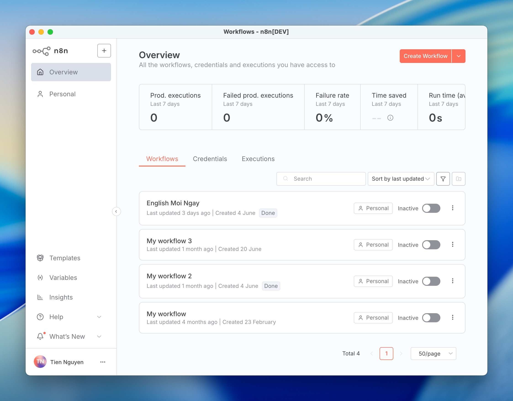

# n8n Desktop

A desktop wrapper for [n8n](https://n8n.io/) - the workflow automation platform that lets you connect anything to everything.

## Demo


## Overview

n8n Desktop is an Electron-based application that provides a native desktop experience for n8n. Instead of running n8n in your browser, this app launches n8n locally and presents it in a dedicated desktop window with enhanced features like:

- Native desktop application experience
- Automatic n8n process management
- Real-time startup logs
- Clean, integrated UI

## Prerequisites

- **Node.js** (version 14 or higher)
- **npm** or **yarn**
- **n8n** must be available globally or via npx

## Installation

1. Clone this repository:
   ```bash
   git clone https://github.com/hxutixnnn/n8n-desktop.git
   cd n8n-desktop
   ```

2. Install dependencies:
   ```bash
   npm install
   ```

## Usage

Start the application:

```bash
npm start
```

The application will:
1. Open with a loading screen showing n8n startup logs
2. Automatically launch n8n in the background
3. Redirect to the n8n interface once it's ready (typically at `http://localhost:5678`)

## How It Works

1. **Startup**: The app displays a loading screen with real-time logs from the n8n startup process
2. **Process Management**: Spawns n8n using `npx n8n` and monitors its output
3. **Auto-Navigation**: Detects when n8n is ready and automatically navigates to the web interface
4. **Cleanup**: Properly terminates the n8n process when the app is closed

## Project Structure

```
n8n-desktop/
├── main.js          # Main Electron process
├── preload.js       # Preload script for secure IPC
├── loading.html     # Loading screen with logs
├── package.json     # Project configuration
└── README.md        # This file
```

## Configuration

The application runs n8n on the default port (5678). If you need to customize this or other n8n settings, you can modify the spawn command in `main.js`.

## Troubleshooting

### n8n Not Found
If you get an error that n8n is not found:
- Install n8n globally: `npm install -g n8n`
- Or ensure npx can access n8n packages

### Port Already in Use
If port 5678 is already in use:
- Stop any existing n8n instances
- Or modify the port configuration in both n8n and this application

### Application Won't Start
- Ensure all dependencies are installed: `npm install`
- Check that Electron is properly installed
- Verify Node.js version compatibility

## Development

To contribute to this project:

1. Fork the repository
2. Create a feature branch
3. Make your changes
4. Test thoroughly
5. Submit a pull request

### Building for Distribution

To build distributable packages, you can add build tools like `electron-builder`:

```bash
npm install --save-dev electron-builder
```

Then add build scripts to `package.json` and configure packaging options.

## Dependencies

- **Electron**: Desktop application framework
- **cross-spawn**: Cross-platform process spawning
- **n8n**: The workflow automation tool (external dependency)

## License

ISC

## About n8n

n8n is a powerful workflow automation tool that allows you to connect different services and automate tasks. Learn more at [n8n.io](https://n8n.io/).

---

**Note**: This is an unofficial desktop wrapper for n8n. For official n8n support and documentation, visit the [n8n documentation](https://docs.n8n.io/).
